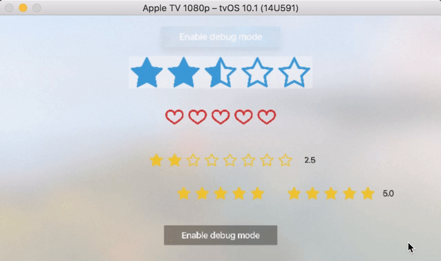
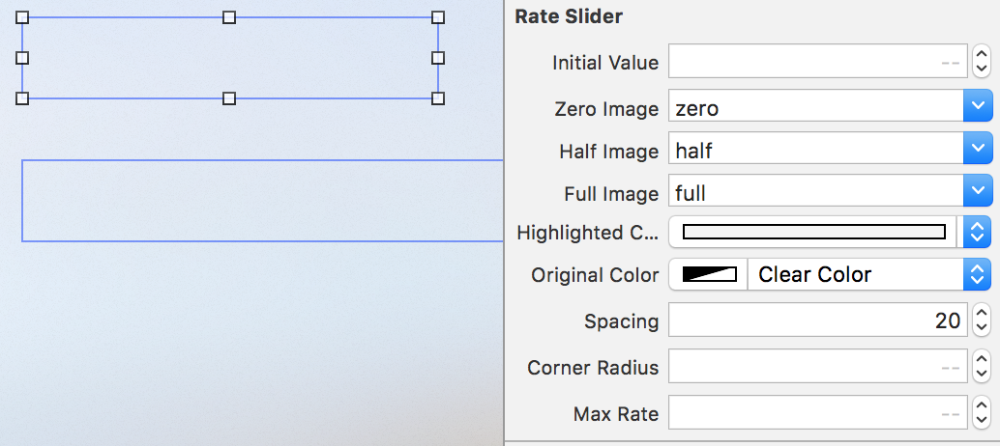
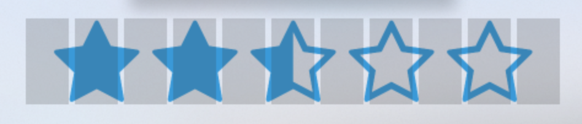

[](https://travis-ci.org/toshi0383/RateTV)
[](https://github.com/Carthage/Carthage)

[](https://raw.githubusercontent.com/Carthage/Carthage/master/LICENSE.md) 

RateTV
---
An awesome Rating view for tvOS.



Fully configurable from InterfaceBuilder.


Focused view is invisible and separeted from visible UI. That means half rating is available if you wish!


# Requirements
tvOS 9.0+

# Usage
## Steps
Available Rate steps 
- half step: 0.0, 0.5, 1.0, 1.5...
- full step: 0.0, 1.0, 2.0 ...

If you prefer half step, set `Half Image` property.   
If you prefer full step, clear out `Half Image` property.

## Rate value observing
To observe rate value change, use `RateSlider.rateValueDidChange` callback closure.
```
    @IBOutlet weak var input: RateSlider! {
        didSet {
            input.rateValueDidChange = {
                [weak self] value in
                print("value: \(value)")
            }
        }
    }
```

## Size
RateSlider's size is inferred from image's size using AutoLayout.  
Make sure that every image is in the same size as you expect it to be.

# Install
Use Carthage

# LICENSE
MIT
